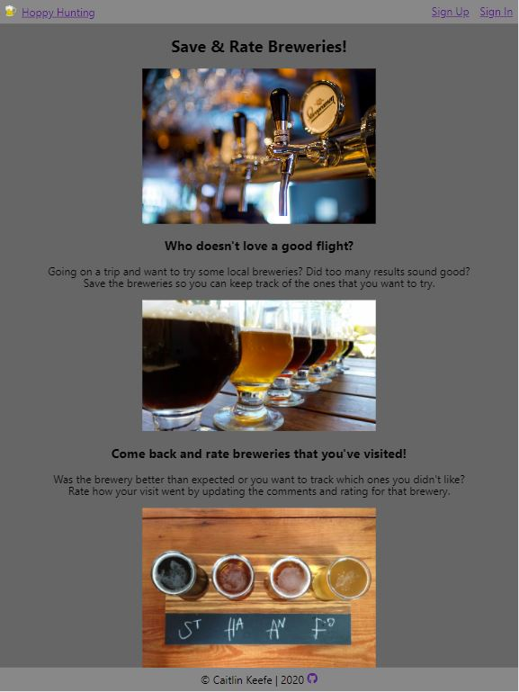
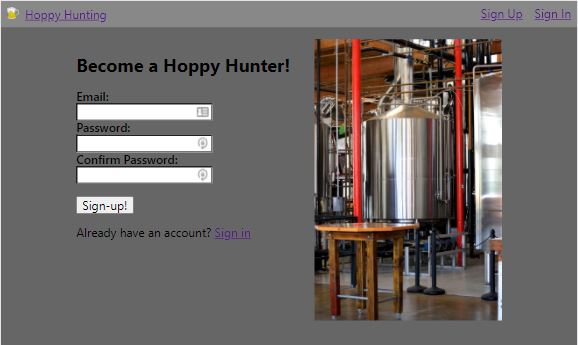
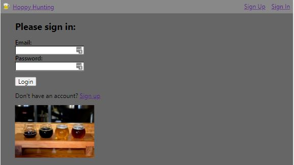
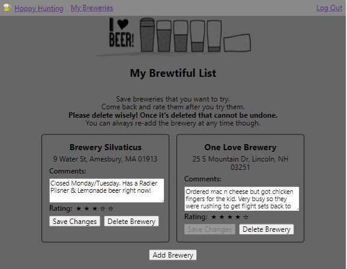

# Hoppy Hunting - Client

## Summary

This is a brewery app that will allow users to save breweries that they want to try. 
Users are required to sign up to create a brewery list.
Users can log out and sign back in to update the breweries that are saved.
Comments are optional. Rating can be updated after the brewery is added.
Save Changes button is disabled until comments or rating is updated. 
Users can delete the brewery. 

## Technology Used

- HTML5
- CSS
- ReactJS

### Testing

- Mocha
- Chai

## Live App

https://hoppy-hunting.vercel.app/

## Server Repository

https://github.com/ckeefe90/Hoppy-Hunting-Server

## App preview

